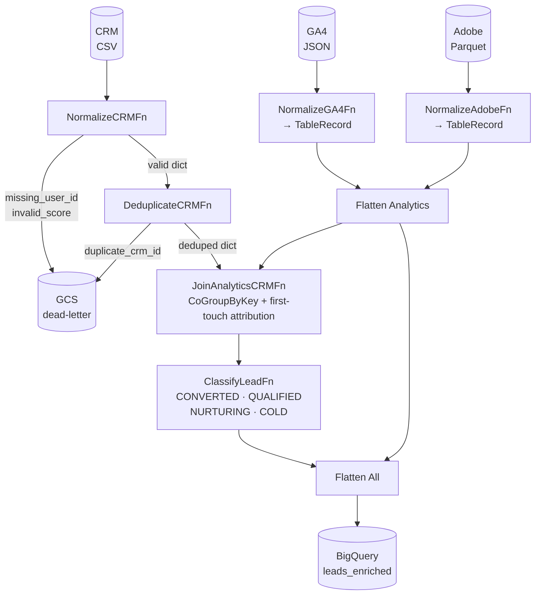

# beam-marketing-pipeline — Architecture

## Pipeline flow



---

### Detailed flow

```
Phase 1 — Parallel ingest
├── GA4   → ReadFromText + json.loads
│           gs://{bucket}/raw/ga4/sessions/account_id={id}/date={date}/*.json
├── Adobe → ReadFromParquet
│           gs://{bucket}/raw/adobe/{report}/account_id={id}/date={date}/*.parquet
└── CRM   → ReadFromText + csv.DictReader
            gs://{bucket}/crm/files/data.csv          ← full weekly load, no partition

Phase 2 — Normalize (parallel per source)
├── GA4   → NormalizeGA4Fn   → TableRecord (source_system="ga4")
├── Adobe → NormalizeAdobeFn → TableRecord (source_system="adobe")
└── CRM   → NormalizeCRMFn   → dict
    ├── Missing analytics_user_id → DeadLetterSink
    └── Invalid lead_score        → DeadLetterSink

Phase 3 — Enrich CRM with Analytics
└── CoGroupByKey(analytics_user_id)
    ├── CRM com match → TableRecord (CRM fields + campaign_name from analytics)
    │   └── Multiple analytics records → first-touch attribution: picks campaign_name
    │       from the record with the oldest date (min date) across GA4 + Adobe
    └── CRM sem match → TableRecord (CRM fields, campaign_name=None)

Phase 4 — Flatten
└── PCollection[TableRecord] analytics + PCollection[TableRecord] CRM enriched
    → beam.Flatten() → single PCollection[TableRecord]

Phase 5 — Lead classification
├── Rules loaded from config/lead_classification_rules.json via setup()
├── Only applied to records where source_system == "crm"
├── CONVERTED → status IN [converted, purchased, subscribed]
├── QUALIFIED → status IN [demo_requested, cart_abandoned, form_completed]
│              AND lead_score >= threshold
├── NURTURING → status IN [email_opened, page_visited, retargeted]
└── COLD      → everything else

Phase 6 — Sinks
├── WriteToBigQuery → {project}.marketing_analytics_silver.leads_enriched  (WRITE_APPEND)
└── DeadLetterSink  → gs://{bucket}/dead-letter/date={run_date}/{run_date}.json
```

---

## GCS storage layout

```
gs://{bucket}/
├── raw/
│   ├── ga4/
│   │   └── sessions/
│   │       └── account_id={account_id}/
│   │           └── date={yyyy-mm-dd}/
│   │               └── *.json
│   ├── adobe/
│   │   └── {report}/
│   │       └── account_id={account_id}/
│   │           └── date={yyyy-mm-dd}/
│   │               └── *.parquet
│   └── crm/
│       └── files/
│           └── data.csv                ← full weekly load, no date partition
└── dead-letter/
    └── date={yyyy-mm-dd}/
        └── {yyyymmdd}.json
```

---

## Schema

Single dataclass — `TableRecord` — represents every row throughout the pipeline.
Fields not populated by a given source default to `""`, `0`, or `None`.

```python
@dataclass
class TableRecord:
    analytics_user_id: str

    # Date — generic, works for session, event or purchase reports
    date: str = ""

    # CRM
    crm_id: str = ""
    status: str = ""
    lead_score: int = 0
    product_interest: str | None = None

    # Analytics (GA4 / Adobe)
    campaign_name: str | None = None
    account_id: str = ""
    account_name: str = ""
    source_medium: str = ""
    sessions: int = 0
    conversions: int = 0
    total_revenue: float = 0.0

    # Pipeline metadata
    source_system: str = ""         # "ga4" | "adobe" | "crm"
    lead_classification: str = ""   # CONVERTED | QUALIFIED | NURTURING | COLD
    processing_date: str = ""
    pipeline_run_id: str = ""
```

---

## Lead classification rules

Defined in `config/lead_classification_rules.json`, loaded via `setup()` in `ClassifyLeadFn`.
Only applied to records where `source_system == "crm"`.

```json
{
  "converted_statuses": ["converted", "purchased", "subscribed"],
  "qualified_statuses": ["demo_requested", "cart_abandoned", "form_completed"],
  "qualified_lead_score_threshold": 70,
  "nurturing_statuses": ["email_opened", "page_visited", "retargeted"]
}
```

| Classification | Meaning                                                                      | Criteria                                         |
| -------------- | ---------------------------------------------------------------------------- | ------------------------------------------------ |
| `CONVERTED`    | Lead became a customer — purchased, subscribed, or marked as converted       | status IN converted_statuses                     |
| `QUALIFIED`    | Lead showed clear purchase intent and has a high enough score                | status IN qualified_statuses AND lead_score ≥ 70 |
| `NURTURING`    | Lead is engaged but has not yet shown purchase intent                        | status IN nurturing_statuses                     |
| `COLD`         | Lead with no relevant engagement or an unrecognised status                   | anything that does not match the rules above     |

---

## Beam metrics

### What are Beam metrics

`apache_beam.metrics.Metrics` is a built-in observability system that lets DoFns emit measurements during execution. Each worker collects its own values; the runner aggregates them at the end. On DirectRunner they are available via `result.metrics()` after the job finishes. On Dataflow they appear in the Cloud Console as a live dashboard during execution.

There are three metric types:

| Type             | What it tracks                               | Example use                              |
| ---------------- | -------------------------------------------- | ---------------------------------------- |
| **Counter**      | Cumulative count of events (integer, +only)  | How many records were processed          |
| **Distribution** | Min / max / mean / count of a numeric value  | Distribution of `lead_score` across leads |
| **Gauge**        | Latest value observed at a point in time     | Current memory usage inside a DoFn      |

This pipeline uses **Counters only**. They are the most common type and sufficient for data quality monitoring.

### How counters work

Counters are defined as class-level attributes using `Metrics.counter(namespace, name)` and incremented inside `process()` with `.inc()`. The namespace groups related metrics — querying `result.metrics().query()` after the job returns all counters keyed as `namespace/name`.

```python
from apache_beam.metrics import Metrics

class MyFn(beam.DoFn):
    records_processed = Metrics.counter("my_namespace", "records_processed")

    def process(self, element):
        self.records_processed.inc()   # increment by 1
        yield element
```

### Counters in this pipeline

| Namespace  | Metric              | DoFn               | What it counts                                        |
| ---------- | ------------------- | ------------------ | ----------------------------------------------------- |
| `ga4`      | `records_processed` | NormalizeGA4Fn     | Records successfully normalized to TableRecord        |
| `adobe`    | `records_processed` | NormalizeAdobeFn   | Records successfully normalized to TableRecord        |
| `crm`      | `records_processed` | NormalizeCRMFn     | Records yielded as valid dicts                        |
| `crm`      | `records_discarded` | NormalizeCRMFn     | Records routed to dead-letter (missing ID or bad score)|
| `join`     | `crm_matched`       | JoinAnalyticsCRMFn | CRM records that found at least one analytics match   |
| `join`     | `crm_no_match`      | JoinAnalyticsCRMFn | CRM records with no analytics match (campaign_name=None)|
| `classify` | `converted`         | ClassifyLeadFn     | Leads classified as CONVERTED                        |
| `classify` | `qualified`         | ClassifyLeadFn     | Leads classified as QUALIFIED                        |
| `classify` | `nurturing`         | ClassifyLeadFn     | Leads classified as NURTURING                        |
| `classify` | `cold`              | ClassifyLeadFn     | Leads classified as COLD                             |

### Match rate alert

**Match rate** = `join/crm_matched / (join/crm_matched + join/crm_no_match)`

After job completion, `log_metrics(result)` in `pipeline/utils/metrics.py` reads all counters, logs each value, and emits a `logger.warning` if the match rate falls below **70%**. A low match rate means most CRM leads have no corresponding analytics session — likely a data ingestion problem upstream.

---

## Project structure

```
beam-marketing-pipeline/
├── pipeline/
│   ├── main.py                       # pipeline entry point
│   ├── options.py                    # MarketingPipelineOptions
│   ├── schemas/
│   │   └── table_record.py           # TableRecord — single output schema
│   ├── sources/
│   │   ├── ga4.py                    # ReadFromText + json.loads
│   │   ├── adobe.py                  # ReadFromParquet
│   │   └── crm.py                    # ReadFromText + csv.DictReader
│   ├── normalize/
│   │   ├── analytics.py              # NormalizeGA4Fn, NormalizeAdobeFn → TableRecord
│   │   └── crm.py                    # NormalizeCRMFn → dict (+ dead-letter)
│   ├── transforms/
│   │   ├── join.py                   # JoinAnalyticsCRMFn (CoGroupByKey + first-touch attribution)
│   │   └── classification.py        # ClassifyLeadFn
│   ├── sinks/
│   │   ├── bigquery.py               # WriteToBigQuery → leads_enriched + dead_letter tables
│   │   └── dead_letter.py            # WriteToText → GCS dead-letter
│   └── utils/
│       └── metrics.py                # log_metrics() + match rate alert
├── config/
│   └── lead_classification_rules.json
├── data/
│   └── fixtures/
│       ├── ga4.json                  # 10 records, NDJSON
│       ├── adobe_analytics.parquet
│       └── crm_2026-04-10.csv        # 15 records
├── tests/
│   ├── conftest.py
│   └── unit/
│       ├── sources/                  # test_ga4, test_adobe, test_crm
│       ├── normalize/                # test_analytics, test_crm
│       └── transforms/               # test_join
├── .github/
│   └── workflows/
│       └── ci.yml                    # pending
├── .vscode/
│   └── launch.json
├── ARCHITECTURE.md
├── CONTEXT.md
├── CLAUDE.md
├── Dockerfile                        # pending
└── pyproject.toml
```

---

## PipelineOptions

```
--bucket        GCS bucket (required)
--project_id    GCP project ID (required)
--date          Processing date yyyy-mm-dd (required)
```

---

## Dependencies

```toml
[project]
requires-python = ">=3.12"
dependencies = [
    "apache-beam[gcp]==2.72.0",
]

[project.optional-dependencies]
dev = [
    "pytest==8.3.0",
    "pytest-cov==5.0.0",
    "ruff==0.8.0",
]
```

---

## Key design decisions

| Decision              | Choice                                     | Reason                                                            |
| --------------------- | ------------------------------------------ | ----------------------------------------------------------------- |
| Single schema         | `TableRecord` for all sources              | Simplifies Flatten — all PCollections share the same type         |
| Join direction        | CRM primary, analytics enriches            | CRM is the lead entity; analytics provides campaign attribution   |
| `source_medium`       | Combined field (`"google / cpc"`)          | Preserves GA4 native format, avoids lossy split                   |
| Classification rules  | JSON config loaded in `setup()`            | Keeps business rules out of code; `setup()` is called on workers  |
| CRM load strategy     | Full weekly load, no date partition        | CRM file is always a full snapshot, not incremental               |
| Dead-letter           | GCS JSON instead of discard                | Preserves bad records for investigation and reprocessing          |
| Sink strategy         | BigQuery only (`leads_enriched` + `dead_letter`) | Analysts query directly from BQ; GCS Parquet silver redundante    |
| Runners               | DirectRunner (dev) → DataflowRunner (prod) | Same code runs on both                                            |
