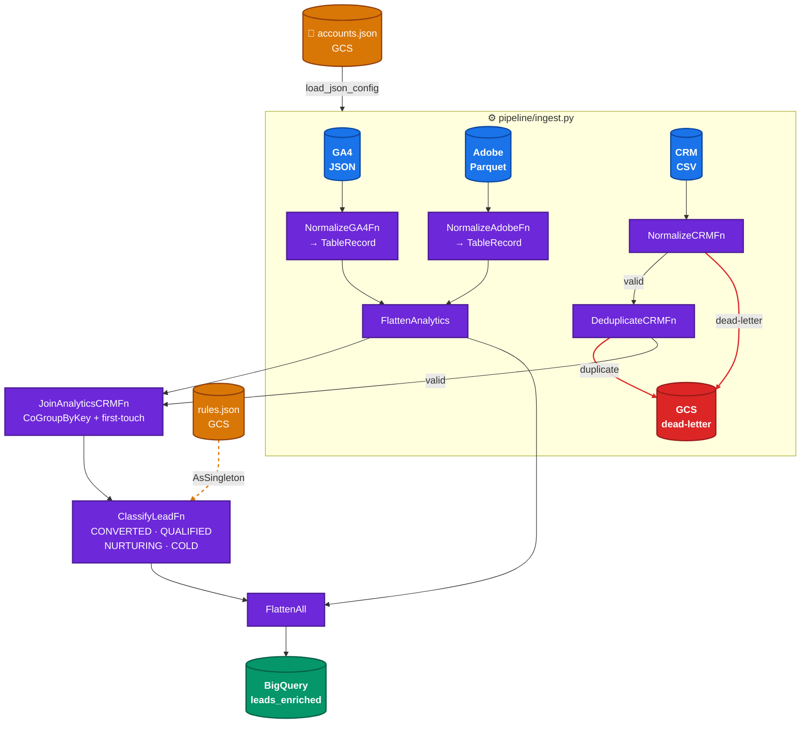

<div align="center">

# 🚀 beam-marketing-pipeline

**Apache Beam pipeline that ingests GA4, Adobe Analytics, and CRM data into BigQuery — running on Google Cloud Dataflow.**

[](https://www.python.org/)
[](https://beam.apache.org/)
[](https://cloud.google.com/dataflow)
[](https://cloud.google.com/bigquery)
[](./tests)
[](.github/workflows)

</div>

---

> 💡 **Backstory included** — This project reimplements a production pipeline I architected for a marketing client. [See the full retrospective](docs/PAST_ARCHITECTURE.md) at the bottom of this README to understand the evolution and why certain patterns were chosen.

---

## 📌 Overview

### 📊 Use Case

A complete, production-ready pipeline that consolidates marketing data from three independent systems into a unified, dashboard-ready BigQuery table:

- **Web Analytics** — Google Analytics 4 & Adobe Analytics  
- **Paid Media** — TikTok, Facebook, Google Ads, DV360  
- **CRM** — Third-party vendor system

The pipeline applies lead classification rules, traces first-touch campaign attribution, and surfaces data quality metrics.

### 🎓 Learning Focus

This project was built to **deeply practice advanced Apache Beam patterns** that hadn't been explored before:

| Pattern | What it teaches |
|---|---|
| 🏷️ **Tagged outputs** | Granular dead-letter routing without cluttering the main pipeline |
| 📊 **Beam metrics** | First-class observability — exposing pipeline health as measurable signals |
| 📥 **Side inputs** (`AsSingleton`) | Runtime configuration injection — update business rules without rebuilding |
| 🐳 **SDK container pattern** | Custom Dataflow worker images for optimized startup performance |
| 🔐 **Workload Identity Federation** | Keyless CI/CD authentication — eliminating long-lived service account keys |

Each pattern is exercised in a realistic, end-to-end context.

---

## � Documentation

Quick links to the four main documentation files:

| Document | Purpose |
|---|---|
| [**ARCHITECTURE.md**](docs/ARCHITECTURE.md) | Deep dive into pipeline design, schema, transforms, and Beam metrics |
| [**TESTING_STRATEGY.md**](docs/TESTING_STRATEGY.md) | Testing philosophy, unit vs integration tests, coverage breakdown (71 tests) |
| [**RUNBOOK.md**](docs/RUNBOOK.md) | Setup instructions, local development, and Dataflow deployment |
| [**CI-CD.md**](docs/CI-CD.md) | GitHub Actions workflows and Workload Identity Federation setup |

> **Getting started?** Start with [RUNBOOK.md](docs/RUNBOOK.md) for prerequisites and local setup.

---

## ⚙️ Prerequisites

Before running the pipeline, ensure you have:

- ✅ **Google Cloud Project** with billing enabled  
- ✅ **GCP APIs enabled** — Dataflow, BigQuery, Cloud Storage, Compute Engine
- ✅ **Service account** with appropriate IAM roles
- ✅ **Python 3.13+** installed locally
- ✅ **GCS bucket** for raw data, config, and outputs
- ✅ **BigQuery dataset** for the output table

**Full setup guide** → See [docs/RUNBOOK.md](docs/RUNBOOK.md) for step-by-step instructions.

---

## �🔄 Pipeline Flow



---

## 🎯 Lead Classification

Rules are stored in `gs://{bucket}/config/lead_classification_rules.json` and injected at runtime as a **Beam side input** — updatable without rebuilding the image.

| Classification | Criteria |
|---|---|
| ✅ `CONVERTED` | `status` in `converted`, `purchased`, `subscribed` |
| 🟢 `QUALIFIED` | `status` in `demo_requested`, `cart_abandoned`, `form_completed` AND `lead_score ≥ 70` |
| 🟡 `NURTURING` | `status` in `email_opened`, `page_visited`, `retargeted` |
| 🔵 `COLD` | Everything else |

---

## 🗂️ Project Structure

```
beam-marketing-pipeline/
│
├── pipeline/
│   ├── main.py                 # Entry point — wires ingest, join, classify, write
│   ├── options.py              # MarketingPipelineOptions (--bucket, --date, --rules_path, --accounts_path)
│   ├── ingest.py               # build_analytics(), build_crm()
│   ├── schemas/                # TableRecord — single unified data model
│   ├── sources/                # read_ga4, read_adobe, read_crm
│   ├── normalize/              # NormalizeGA4Fn, NormalizeAdobeFn, NormalizeCRMFn
│   ├── transforms/             # JoinAnalyticsCRMFn, ClassifyLeadFn, DeduplicateCRMFn
│   ├── sinks/
│   │   ├── bigquery.py         # write_leads_enriched
│   │   ├── dead_letter.py      # write_dead_letter
│   │   └── write.py            # write_pipeline_output — combines both sinks
│   └── utils/
│       ├── config.py           # load_json_config() — local or gs:// paths
│       └── metrics.py          # log_metrics() + match rate alert
│
├── config/
│   ├── lead_classification_rules.json   # Uploaded to GCS on change
│   └── accounts.json                    # List of account_ids to ingest
│
├── data/fixtures/              # Local test data (GA4 JSON, Adobe Parquet, CRM CSV)
│
├── tests/
│   ├── unit/                   # Per-DoFn isolation tests (62 tests)
│   └── integration/            # Full pipeline end-to-end with DirectRunner (9 tests)
│
└── docs/
    ├── ARCHITECTURE.md         # Detailed pipeline flow, schema, Beam metrics
    ├── TESTING_STRATEGY.md     # Unit vs integration, coverage table
    ├── RUNBOOK.md              # Setup, local run, Dataflow deployment
    └── CI-CD.md                # GitHub Actions + Workload Identity Federation
```

---

## ⚙️ GCS Layout

```
gs://{bucket}/
├── config/
│   ├── lead_classification_rules.json
│   └── accounts.json
├── raw/
│   ├── ga4/sessions/account_id={id}/date={yyyy-mm-dd}/*.json
│   ├── adobe/{report}/account_id={id}/date={yyyy-mm-dd}/*.parquet
│   └── crm/files/data.csv
└── dead-letter/date={yyyy-mm-dd}/{yyyymmdd}.json
```

---

## 🏃 Running Locally

```bash
# Install dependencies
pip install -e ".[dev]"

# Run the pipeline
python pipeline/main.py \
  --bucket=your-gcs-bucket \
  --project=your-gcp-project \
  --date=2026-04-11 \
  --temp_location=gs://your-bucket/tmp
```

> `--rules_path` and `--accounts_path` default to `gs://{bucket}/config/` — upload both JSON files before the first run.

---

## ☁️ Running on Dataflow

```bash
python pipeline/main.py \
  --runner=DataflowRunner \
  --project=your-gcp-project \
  --region=us-central1 \
  --bucket=your-gcs-bucket \
  --date=2026-04-11 \
  --temp_location=gs://your-bucket/tmp \
  --sdk_container_image=us-central1-docker.pkg.dev/your-project/beam-marketing-pipeline/pipeline:latest \
  --no_use_public_ips
```

> See [docs/RUNBOOK.md](docs/RUNBOOK.md) for full setup — GCP APIs, subnet configuration, Artifact Registry.

---

## 🧪 Tests

```bash
pytest tests/unit/         # Fast feedback — no I/O (62 tests)
pytest tests/integration/  # Full pipeline with DirectRunner + GCS fixtures (9 tests)
pytest                     # Everything (71 tests)
```

> Integration tests run against real GCS fixtures — no BigQuery writes; sinks replaced by `assert_that`.

---

## 🔁 CI/CD

| Workflow | Trigger | What it does |
|---|---|---|
| `ci.yml` | Push to `main` | Ruff lint + unit tests |
| `publish.yml` | Manual (`workflow_dispatch`) | Build + push Docker image to Artifact Registry |

Authentication via **Workload Identity Federation** — no service account keys stored anywhere. See [docs/CI-CD.md](docs/CI-CD.md).

---

## 🛠️ Stack

| Layer | Technology |
|---|---|
| Pipeline runtime | Apache Beam 2.72.0 |
| Production runner | Google Cloud Dataflow |
| Data warehouse | BigQuery |
| Storage | Google Cloud Storage |
| Container registry | Artifact Registry |
| Language | Python 3.13 |

---

## 📖 Context & Evolution

> 🔍 **Interested in the backstory?** This project was inspired by a production system I built and architected for a marketing client several years ago.

**[Read the full retrospective → `docs/PAST_ARCHITECTURE.md`](docs/PAST_ARCHITECTURE.md)**

The original pipeline was built in **Java with Apache Beam** and ran on **Google Cloud Dataflow**, consolidating data from:
- 📊 Web analytics (GA4, Adobe Analytics)
- 💰 Paid media platforms (TikTok, Facebook, Google Ads, DV360)
- 🗂️ CRM system (weekly snapshots)

**This Python rebuild** exercises advanced Beam patterns that weren't exposed or needed in the original:
- **Tagged outputs** for granular dead-letter routing
- **Beam metrics** as first-class observability signals
- **Side inputs** for runtime rule injection without rebuilds
- **Workload Identity Federation** for keyless CI/CD
- **Custom SDK containers** for optimized Dataflow startup

If you're interested in how distributed data pipelines evolve with experience and new tools — and how the same problem can be solved differently today — check out the retrospective.
